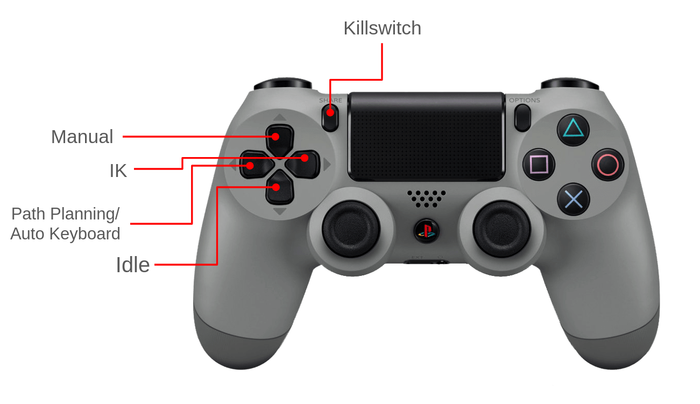
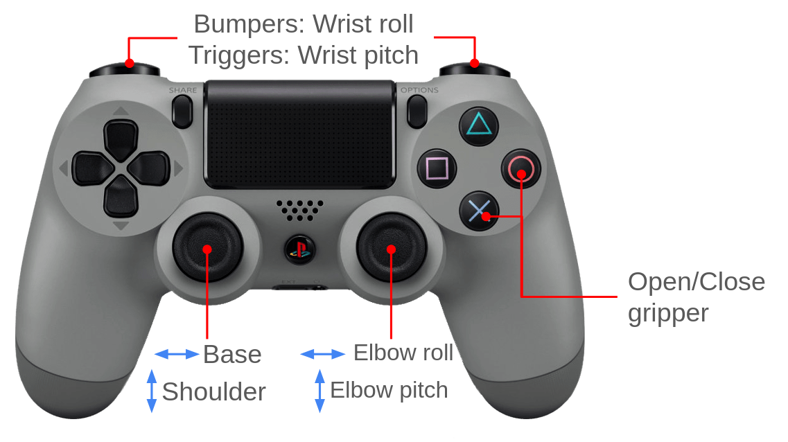
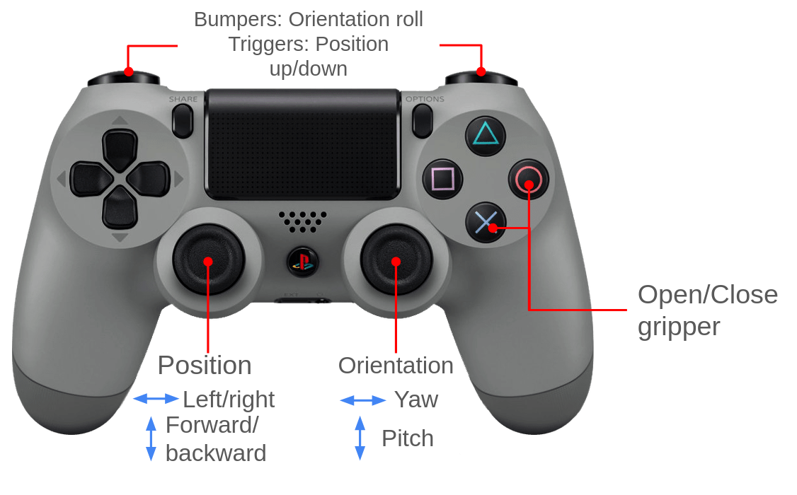

# How to run the arm
## Starting up
1. Connect arm to power supply. Ensure daisy chaining is done correctly and all Sparkmaxes/motors have power.

2. Connect arm CAN network to computer via CAN USB and ensure all connections are secure.

3. Run 
```bash
bash setup-can.sh
``` 
in the rsx-arm package to initialize the CAN network.

4. Turn on the power supply output 
5. Open a terminal and run:
```bash
ros2 launch arm_launch arm_basics_launch.py
```
This can be run with the following arguments (appended to command as `argument:=value`):
- ik_on (default true)
- virtual (default false)
  - Will also launch RViz and the node that redirects outputs to it, if set to true
- gui_on (default false, untested on main)
  
If the launch files are not working, run the following commands, each in a separate terminal:
```bash
ros2 run arm_controller main_controller
ros2 run joy joy_node
ros2 launch moveit_path_planning planner_server_topic_publisher.py
```

## Optional nodes
- To start up the GUI: ```ros2 run gui arm_gui```
- To run the RealSense camera node: ```ros2 run realsense2_camera realsense2_camera_node```
  - **Important:** To publish camera data to the GUI:
```ros2 run auto_keyboard camera_node```

## Controls
### General

### Manual

### IK


## Things to look out for
- Joint state retention post program crash is not fully tested - be cautious when restarting the controller script after it has been shutdown and the arm was moved 
- Always turn off the controller script prior to cutting power to the CAN network if possible - otherwise CAN network buffer will fill up and the CAN network will need to be restarted (power cycle)
