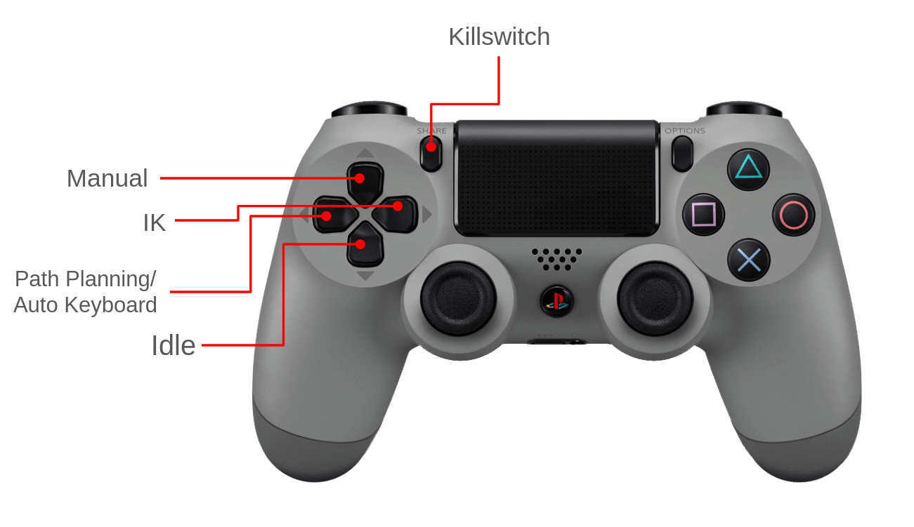
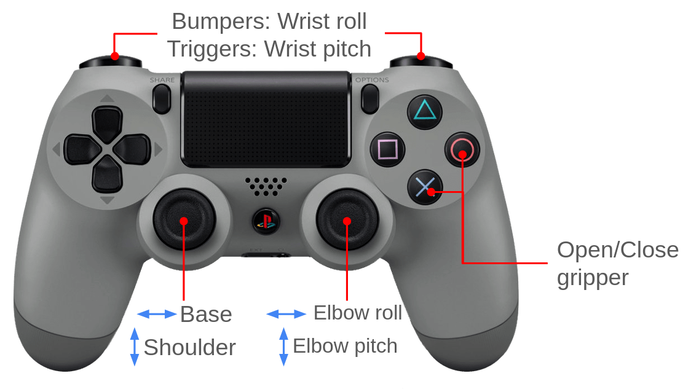
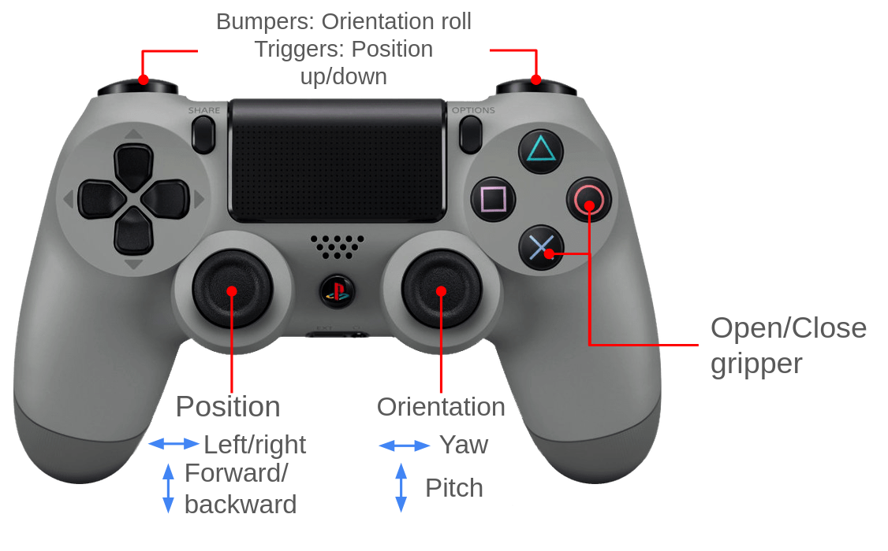

# How to run the arm
## Starting up
1. Connect arm to power supply. Ensure daisy chaining is done correctly and all Sparkmaxes/motors have power.

2. Connect arm CAN network to computer via CAN USB and ensure all connections are secure.

3. Run 
```bash
bash setup_can.sh
``` 
in the rsx-arm package to initialize the CAN network.

4. Turn on the power supply output
   
**4.5. Folllow ONLY IF you are on the arm laptop**

Open a terminal and run:
```bash
ros2 run rmw_zenoh_cpp rmw_zenohd
```
This command emulates some of the ROS1 behaviour the rover still uses. Append an & to the command to run it in the background. 
   
5. Open a terminal and run:
```bash
ros2 launch arm_launch arm_basics_launch.py
```
This can be run with the following arguments (appended to command as `argument:=value`):
- ik_on (default true)
- virtual (default false)
  - Will also launch RViz and the node that redirects outputs to it, if set to true
- gui_on (default false, untested on main)
  
If the launch files are not working, run the following commands, each in a separate terminal:
```bash
ros2 run arm_controller main_controller
ros2 run joy joy_node
ros2 launch moveit_path_planning planner_server_topic_publisher.py
```

## Optional nodes
- To start up the GUI: ```ros2 run gui arm_gui```
- To run the RealSense camera node: ```ros2 run realsense2_camera realsense2_camera_node```
  - **Important:** To publish camera data to the GUI:
```ros2 run auto_keyboard camera_node```

## Controls
### General

### Manual

### IK


## Things to look out for
- Joint state retention post program crash is not fully tested - be cautious when restarting the controller script after it has been shutdown and the arm was moved 
- Always turn off the controller script prior to cutting power to the CAN network if possible - otherwise CAN network buffer will fill up and the CAN network will need to be restarted (power cycle)

## Joystick setup on WSL

## Windows side

Install usbipd-win:
```powershell
winget install usbipd
```

List connected USB devices to find the joystick's bus ID:
```powershell
usbipd list
```

Bind the device (one-time, persists across reboots):
```powershell
usbipd bind --busid X-X
```

Attach it to WSL (needed every time the device is replugged or Windows is rebooted):
```powershell
usbipd attach --wsl --busid X-X
```

## Ubuntu (WSL) side

### USB/IP client tools
```bash
sudo apt update
sudo apt install -y linux-tools-generic hwdata
sudo update-alternatives --install /usr/local/bin/usbip usbip /usr/lib/linux-tools/*-generic/usbip 20
modprobe vhci-hcd
```

### Permissions
```bash
sudo usermod -aG input $USER
```
Required a full WSL restart (`wsl --shutdown` from Windows, then reopen) to take effect.

### Find your joystick's device path

```bash
ls /dev/input/js*
```
Usually `js0`, but if you have other input devices already attached it may be a different number — check which one is yours by testing below. The rest of this guide uses `js0` as an example; substitute your actual device.

### Verify raw device access
```bash
sudo apt install -y joystick
jstest /dev/input/js0
```
### Verify ROS2 access
```bash
ros2 run joy joy_enumerate_devices
```

### If ROS2 is not detecting the joystick

**Potential issue:** WSL's `usbipd` passthrough doesn't trigger the normal udev classification that happens when a USB HID joystick is plugged in directly on bare metal. SDL2 (used internally by ROS2's `joy_node`) relies on the `ID_INPUT_JOYSTICK` udev property to enumerate devices, and that tag might be missing.

Confirm via:
```bash
udevadm info -q property -n /dev/input/js0 | grep ID_INPUT_JOYSTICK
```
(no output = tag missing)

### Fix — manual udev rule to tag `js0`

```bash
echo 'KERNEL=="js0", SUBSYSTEM=="input", ENV{ID_INPUT_JOYSTICK}="1"' | sudo tee /etc/udev/rules.d/99-joystick.rules
sudo udevadm control --reload-rules
sudo udevadm trigger
```

Verify tag:
```bash
udevadm info -q property -n /dev/input/js0 | grep ID_INPUT_JOYSTICK
# ID_INPUT_JOYSTICK=1
```

## Still not detected with ROS2 enumeration

If enumeration still returns nothing, SDL2's evdev backend reads the tag from the associated `/dev/input/eventX` device, not `js0` directly.

Find the paired event device:
```bash
cat /proc/bus/input/devices | grep -B5 -A10 -i joystick
```
Look for the `Handlers=` line in the matching block — it lists both handlers together, e.g.:
```
Handlers=event0 js0
```
The `eventN` on that line is the one paired with your joystick. (If your device doesn't report "joystick" in its name, drop the grep filter and scan `cat /proc/bus/input/devices` manually for the block whose `Handlers=` line includes your `jsN` device.)

Apply the same tag to that event device (substitute your actual `eventN`):
```bash
echo 'KERNEL=="event0", SUBSYSTEM=="input", ENV{ID_INPUT_JOYSTICK}="1"' | sudo tee -a /etc/udev/rules.d/99-joystick.rules
sudo udevadm control --reload-rules
sudo udevadm trigger
```

Retest:
```bash
ros2 run joy joy_enumerate_devices
```

### Final rules file

Once resolved, `/etc/udev/rules.d/99-joystick.rules` should contain two lines — one for your `jsN` device, one for its paired `eventN`:
```
KERNEL=="js0", SUBSYSTEM=="input", ENV{ID_INPUT_JOYSTICK}="1"
KERNEL=="event0", SUBSYSTEM=="input", ENV{ID_INPUT_JOYSTICK}="1"
```
(numbers will vary per system)

### Note on multiple joysticks

If you have more than one joystick/gamepad attached, each will need its own pair of rules (one `jsN`, one matching `eventN`), identified the same way.